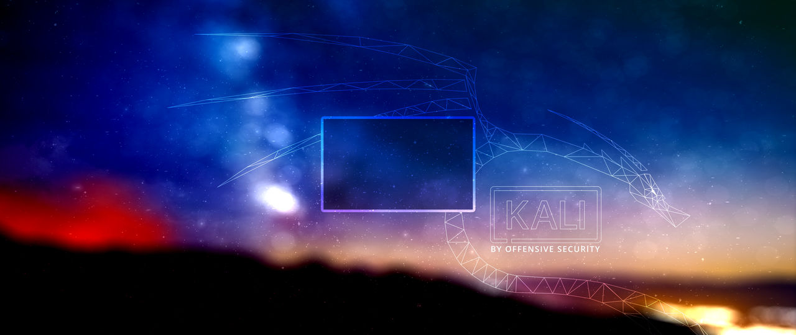
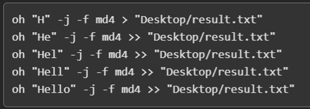
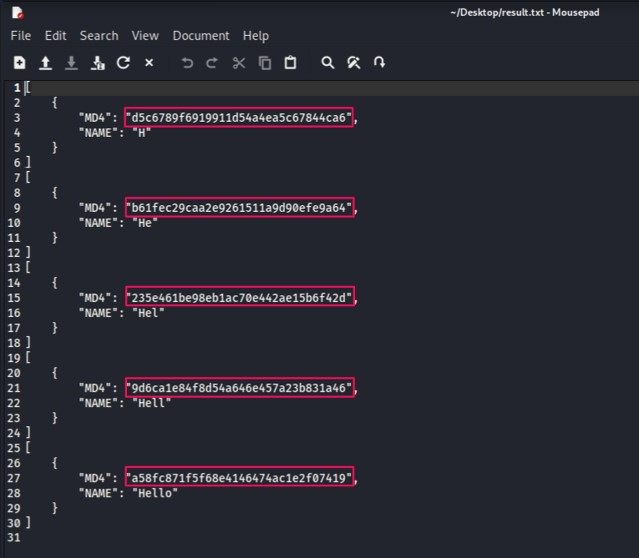
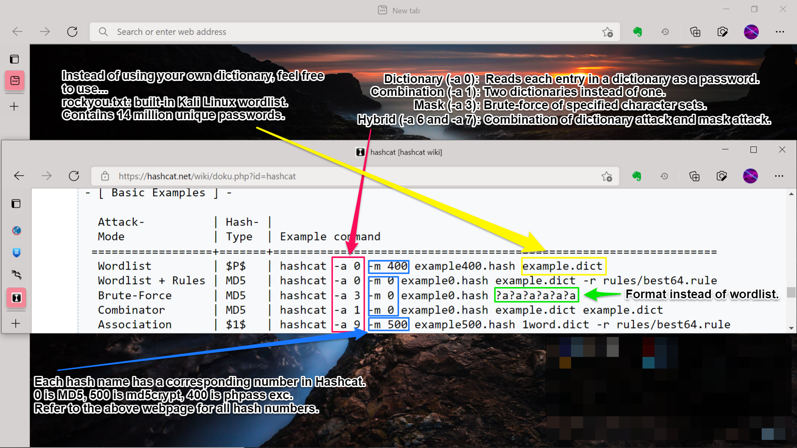
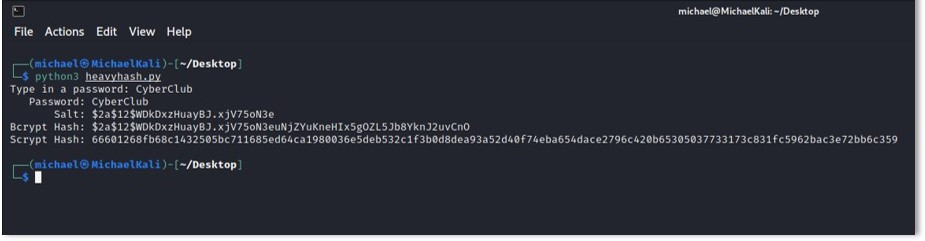

# Password Cracking

Today, we'll be **password cracking** on your favorite Linux interface.  The purpose of this assignment is so that you may familiarize yourself with offensive security and **red team principles**. Hopefully, this assignment will encourage you to use stronger passwords for your online accounts.

By the end of this assignment, you will be able to:  
- Navigate through the Kali Linux environment.
- Understand the difference between weak hashes and strong hashes.
- Familiarize yourself with tools used for CTF competitions.
- Implement secure password storage for your own projects.

## Install Kali Linux

We'll be using a beginner friendly tool - Kali Linux. It is the premier pen testing tool. In addition, it has a large community and advanced features.  



You'll want to start off by downloading **[VirtualBox](https://www.virtualbox.org/)**. VirtualBox is a cross-platform virtualization software developed by Oracle Corporation that allows a user to run guest operating systems on their host operating system without the need for partitioning their hard drive or running another OS on dual boot. These guest OS include Microsoft Windows, Mac O X, Linux, and Oracle Solaris, amongst others.

You'll then want to follow the steps in **[this article](https://phoenixnap.com/kb/how-to-install-kali-linux-on-virtualbox)**. This can be a tedious process, but do not be discouraged! It is normal for bugs in software or hardware to occur. This is where iteration and patience is key. You may come across a *‘fatal system kernel error’* message in the process - in that case, downgrade VirtualBox to a different version.  

Please set aside a generous amount of space on your hard disk. In step 2 part 7, the article says 8GB but choose 20GB. If you choose that low amount and run out of memory in your Kali Linux, you will have to partition more space from your host OS. This process is feasible but tedious. In addition, choose 2048 MB Memory size instead of the default 1024 MB in step 2 part 3.

Once you have completed all steps, delete the `.iso` file. The virtual machine, which is an emulation of a computer system, is already installed, so no need to consume disk space! It is there simply for installation purposes.

Virtualbox runs once you turn off your hypervisor. Systems like WSL 2 requires hypervisor. You'll have to alternate between the commands to run either system:  
```
bcdedit /set hypervisorlaunchtype off  
bcdedit /set hypervisorlaunchtype auto  
```
Run the relevant command on Powershell with administrator privileges. Then, restart the computer. 

## Alternatives to Kali Linux

If you need a lightweight alternative, **[Parrot OS](https://parrotsec.org/docs/installation.html)** is your best friend. It has a similar toolset and is an equally viable option to Kali Linux.

You could also install **[Window Subsystem for Linux](https://docs.microsoft.com/en-us/windows/wsl/install)** on your Windows OS. This helps if you are running low on space, since you can install the Linux tools you need, rather than the OS itself. Click **[here](https://simontaplin.net/2019/03/29/how-to-install-all-the-penetration-testing-tools-in-kali-linux-for-windows-subsystem-for-linux/)** to 
learn more.

## Getting Started

Once you have Kali Linux interface setup, you'll want to open up your terminal in Kali Linux and install the following commands.

```
sudo apt-get update 
sudo apt-get upgrade
sudo apt-get dist-upgrade 
sudo apt install python3-pip 
sudo apt-get install python3 
python3 -m pip install pysha3 
sudo pip3 install bcrypt 
sudo pip3 install scrypt 
sudo pip3 install omnihash 
```

You may copy all these commands and paste them into your terminal, rather than going one by one. All of the installed packages will be used throughout this assignment.

## Ophcrack - LanMan Rainbow Table

**Ophcrack** is an open-source program that uses rainbow tables to crack Windows XP log-in passwords using LM hashes algorithm. It's a popular tool for recovering Windows passwords, as an alternative for say, resetting one's Windows password if missing. It comes preinstalled with Kali Linux.  

LanMans are easy to crack because:  
1. Windows set a 14 character limit on passwords.  
2. The password was split into two seperate parts before stored as two small hashes.

You may view **[Ophcrack's How-to Guide](https://sourceforge.net/p/ophcrack/wiki/ophcrack%20Howto/)**, but you'll primarily want to focus on their free **[Ophcrack Rainbow Tables](https://ophcrack.sourceforge.io/tables.php)** page.

Now, install the XP Free Fast table:


You will receive the zip file `tables_xp_free_fast`. Extract `tables_xp_free_fast` into its own directory and put it in a location you know you will find it.

Now, create two text files: `preLANPasswords.txt` and `postLANPasswords.txt` and put those files in an easily accessible location. Paste any set of your own passwords into the `preHashPasswords.txt` file.

Now, go to **[Tobtu Hash Generator](https://tobtu.com/lmntlm.php)** online and paste your passwords into it. After selecting `Generate Passwords`, you will retrieve LM Hashes, which will be inserted into the `PostHashPasswords.txt` file:


In OphCrack, open `Tables` in the toolbar and select `XP free fast`. Click `Install`. Then, open the folder `tables_xp_free_fast`:


Load->Session File->`postLANPasswords`. A list of your LM Hashes will appear in its own column:


Press `Crack` in the toolbar, and commence cracking. View which passwords return and which passwords don't return!

If you compare the results with your `preLANPasswords` file, you will see which passwords are easy to crack. You can do this by comparing the concatenation of the `LM Pwd 1` and `LM Pwd 2` columns. In the example below, you can see the passwords that were returned and those which were not:

  

### Task 1: 
Repeat this rainbow table task using common passwords and random passwords. You can download more rainbow tables from the website and set the corresponding name in Ophcrack as before. Be wary of the amount of space in your Kali Linux! Download the tables that are less than 5GB. Multiple tables will run per crack. After multiple runs, do you see any limitations on using rainbow tables for password cracking? How does this align with the way rainbow tables work?

## Omnihash

This tool is meant to get weaker hashes in bulk. Here is two different commands:  
(*NOTE: This isn't an explicit tool, run from terminal*)
```
omnihash "Desktop/test.txt" -j -f md4 -f md5 -f blake2b -f sha1 > "Desktop/result.txt"  
oh "Desktop/test.txt" > "Desktop/result.txt"
```  
This works if you create both files on your desktop. You can begin with omnihash or just type oh. The first command stores the hash values of md4, md5, blake2b, and sha1 in the file. The second command stores the input length + all 17 possible hash values into the file.  

Alternatively, you can type input to the command line and continously append to the same .txt file. Below is that approach.  






These files give you hashed values for use in Hashcat. You have a baseline for testing... you know the original input to test the password cracking results.

## Hashcat

Suppose you are given some hash value and you're expected to find the original input...  
Hashcat is very effective at cracking passwords, but there's a catch. You MUST know the correct hash algorithm associated with the hash value before using this tool. Luckily, **hash-identifier** does just that. The tool is preinstalled on Kali Linux and it's very straightforward. Type your mystery hash value into the tool and it will return its best guesses (Possible hashes) and other possibilities (Least Possible Hashes). Frequently, the best guesses are wrong! If using the first hash guess returns nonsense in Hashcat, go down the list in hash identifier and try that.  

Below is the format of HashCat commands:  

  

A quick demo of Hashcat would not do this tool justice. Look at the official documentation and view Youtube tutorials. There is so much depth to this tool, you will need to do online research in your own time to effectively use it.

## Secure Password Storage  

Here's a quick overview of hashes.  
1. Outdated hashes: LanMan, MD5, SHA-1, Panama  
2. Government standard: SHA-256  
3. Strong hashes: Argon2id, bcrypt, scrypt, PBKDF2  

When building a website, you want to store user passwords as hashes. However, using outdated hashes is a vulnerability. Here, we'll use bcrypt and scrypt hashes.  

Proof that bcrypt, scrypt are great hashes:  
**Twitter**, **Reddit**, **Slack**, **Imgur**, and **GitHub** use bcrypt.  
**Facebook** uses scrypt.  
(*NOTE: These websites may not EXCLUSIVELY use bcrypt/scrypt, but it is part of their process.*)

One of the reasons their strong is b/c it **salts** the passwords.  

All relevant code is in heavyhash.py . The code is for demonstration purposes. Here is the output:  



### Task 2: 
Change up the code to check user credentials from a user login attempt. Set up a simple database with a hashed password and check the login password by putting it through the same hash algorithm. If it's a match, the user can login. If not, return an error message. You now know how to manage passwords for your projects.

### Task 3: 
Play around with the **work factor** parameter for bcrypt.gensalt(rounds) in heavyhash.py . The default value is rounds=12. Do you notice a difference in runtime? Companies face a similar trade-off in security vs. convenience. Using a higher work factor is more secure, but a longer wait time. Default work factor will give a short wait time. There are more parameters for you to manipulate in **[scrypt](https://cryptobook.nakov.com/mac-and-key-derivation/scrypt)** resulting in increased runtime. What trade-off would you prefer for your projects?  

## Conclusion  

There are people in the security community that password crack all day. There are a lot more intricacies to password cracking not explored in this repository. If you've found this topic interesting, feel free to explore more about the topic online. Once you get comfortable using Kali Linux tools, familiarizing yourself with different hashes, effectively using Hashcat, feel free to call yourself a security researcher :).  

Thanks for taking interest in our club.