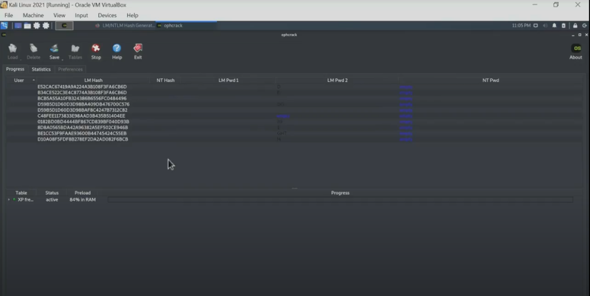

# Password Cracking

Today, we'll be **password cracking** on your favorite Linux interface.  The purpose of this assignment is so that you may familiarize yourself with offensive security and **red team principles**. Thus, by the means of hashing, you will learn what the best password principles are.

We'll primarily be working with the **LanMan** hash, which was used in outdated Windows versions.

We'll be using Hash Identifier Accuracy for...

We'll be using Hashcat for...

## Install Kali Linux

We'll be going with a beginner friendly tool - Kali Linux. It is the premier choice amongst pen testing tool; coming with a large community and advanced features.

You'll want to start off by downloading **[VirtualBox](https://www.virtualbox.org/)**. VirtualBox is a cross-platform virtualization software developed by Oracle Corporation that allows a user to run guest operating systems on their host operating system without the need for partitioning their hard drive or running another OS on dual boot. These guest OS include Microsoft Windows, Mac O X, Linux, and Oracle Solaris, amongst others.

You'll then want to follow the steps in [**this article**](https://phoenixnap.com/kb/how-to-install-kali-linux-on-virtualbox). This can be a tedious process, but do not be discouraged! It is normal for bugs in software or hardware to occur. This is where iteration and patience is key. You may come across a *‘fatal system kernel error’* message in the process - in that case, downgrade VirtualBox to a different version.

Once you have completed all steps, delete the `.iso` file. The virtual machine, which is an emulation of a computer system, will be installed already, so no need to consume disk space! It is there simply for installation purposes.

Virtualbox runs once you turn off your hypervisor. Systems like WSL 2 requires hypervisor. You'll have to alternate between the commands to run the either system:
<bcdedit /set hypervisorlaunchtype off
bcdedit /set hypervisorlaunchtype auto>
Run the relevant command on powershell with administrator privledges. Then, restart the computer. 

### Alternatives to Kali Linux

If you need a lightweight alternative, **[Parrot OS](https://parrotsec.org/docs/installation.html)** is your best friend. It has a similar toolset and is an equally viable option to Kali Linux.

You could also install **[Window Subsystem for Linux](https://docs.microsoft.com/en-us/windows/wsl/install)** on your Windows system. This helps if you are running low on space, since it installs the Linux tools you need, rather than the OS itself.

## Getting Started

Once you have a Linux interface setup, you'll want to open up your terminal and install the following commands.

```
sudo apt-get update 
sudo apt-get upgrade
sudo apt-get dist-upgrade 
sudo apt install python3-pip 
sudo apt-get install python3 
python3 -m pip install pysha3 
sudo pip3 install bcrypt 
sudo pip3 install scrypt 
sudo pip3 install omnihash 
```

You may copy all these commands and paste them into your terminal, rather than going one by one. We'll be going over the usage of the packages installed shortly.

## Ophcrack - LanMan Rainbow Table

**Ophcrack** is an open-source program that uses rainbow tables to crack Windows XP log-in passwords using LM hashes. It's a popular tool for recovering Windows passwords, as an alternative for say, resetting one's Windows password if missing.

You may view [Ophcrack's How-to Guide](https://sourceforge.net/p/ophcrack/wiki/ophcrack%20Howto/), but you'll primarily want to focus on their free [Ophcrack Rainbow Tables](https://ophcrack.sourceforge.io/tables.php) page.

Now, install the XP Free Fast table:


You will receive the zip file `tables_xp_free_fast`. Extract `tables_xp_free_fast` into its own directory and put it in a location you know you will find it in.

Now, create two text files: `PreLANPasswords.txt` and `PostLABPasswords.txt` and put those files in an easily accessible location. Paste any set of your own passwords into the `PreHashPasswords.txt` file.

Now, go to [Tobtu Hash Generator](https://tobtu.com/lmntlm.php) online and paste your passwords into it. After selecting `Generate Passwords`, you will retrieve LM Hashes, which will be inserted into the `PostHashPasswords.txt` file:


In OphCrack, open `Tables` in the toolbar and select `XP free fast`. Then, open the folder  `tables_xp_free_fast` and install the tables in the `XP free fast` table:


Load the `postLANPasswords` file into Ophcrack. A list of your LM Hashes will appear in its own column:



Press `Crack` in the toolbar, and commence cracking. View which passwords return and which passwords don't return!

If you compare the results with your `PreLANPasswords` file, you will see which passwords are easy to crack. You can do this by comparing with the `LM PWD 1` table. In the example below, you can see the passwords that were returned and those which were not:


## Hash Identifier Accuracy

sdufijnks

## HashCat

dsfnjs
